---
author:
- |
  David Berthiaume, Catherine Gai, Chau Nguyen,  
  Yuan Tang, Emilia Mazzolenis
bibliography:
- references.bib
title: "ChildSynth: Leveraging Synthetic Imagery for Automated Height
  Measurement in Malnutrition Prediction"
---

# ChildSynth

Predicting childhood malnutrition is a critical task in the field of
public health. Malnutrition among children is still a significant public
health problem in many developing countries. It is a primary cause of
morbidity and mortality in children. Malnutrition is a condition that
results from eating a diet in which one or more nutrients are
insufficient, such that the diet causes health problems.

This paper proposes a novel approach to predict malnutrition in children
using synthetic imagery. We leverage the power of synthetic data to help
evaluate and train several deep-learning models to predict heights in
children to support the prediction of malnutrition.

Obtaining data for training deep learning models is a challenging task.
The data must be labeled and annotated, which can be time-consuming and
expensive. Obtaining images of children to train a model to predict
malnutrition is even more challenging. These images and height
measurements must be taken in a controlled environment with trained
personnel to ensure high accuracy. Furthermore, this data is highly
sensitive since it involves images of children.

To combat these challenges, a synthetic data generator, ChildSynth, was
developed to create images of children with pixel-perfect height
measurements. This synthetic data generator can create an unlimited
number of images of children with varying characteristics and
pixel-perfect heights. The generated synthetic data can be used to
evaluate and pre-train deep learning models to predict children’s
height.

# Introduction

ChildSynth is a command-line program that uses procedural modeling and
raytracing powered by Pov-RAY  to generate color images, depth maps,
segmentation maps, keypoints, precise height measurements, and auxiliary
information for synthetic children lying on a mat as viewed from
different camera angles. The following example command generates RGB
images, depth maps, segmentation maps, and auxiliary text files with
height measurements and other characteristics for $5$ different camera
angles for a total of $15$ images.

``` bash
python render_children.py --resy 512 --resx 512 --num_children 1     --output_dir ./output 
```

Figure <a href="#fig:child_0" data-reference-type="ref"
data-reference="fig:child_0">1</a> shows an example of a synthetic child
generated by the above command.

<figure id="fig:child_0">
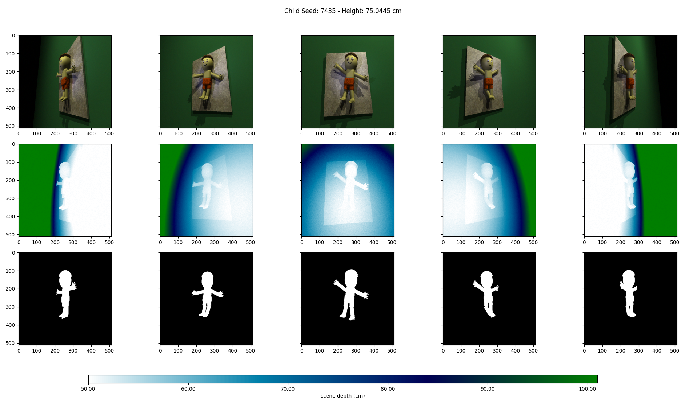
<figcaption>Example of a synthetic child generated by ChildSynth. The
upper row consists of color images, the middle row consists of depth
maps, and the bottom row consists of binary segmentation maps indicating
whether each pixel is part of a child or part of the
background.</figcaption>
</figure>

The goal of ChildSynth is not to generate photorealistic images but to
parametrically model children with infinite variations and with
pixel-perfect measurements. Every element, the length, style, density,
and color of hair, the facial characteristics, the skin and mat
textures, even the size of each toe, is modeled parametrically and can
be individually specified or sampled from various random distributions.
Elements of the scene, including camera position, lighting, and image
quality, are also parametrically modeled. One can specify over $100$
different parameters to control how the children and scenes are
rendered.

Photorealistic images are not always necessary for achieving excellent
results in training computer vision models. Depending on the specific
application and tasks, computer vision systems can be effectively
trained using synthetic or stylized imagery that does not mimic the full
complexity of real-world visuals but instead retains essential
structural and contextual elements needed for the model to learn and
perform accurately. For example, non-photorealistic rendering was
successfully used to train models for autonomous driving in complex
urban environments under many weather conditions, where logistical
challenges prevent training and testing such systems in the physical
world . Non-photorealistic rendering was also successfully used by
OpenAI for reinforcement learning applications in robotics .
Furthermore, using realistic static meshes or generative AI would
greatly reduce this flexibility and make it difficult to generate the
vast number of images with precise and exhaustive measurements needed to
train a deep-learning model.

This fully parametric modeling provides two primary benefits.

- **Explainability:** By providing precise measurements for over $100$
  different feature of the generated image, this data provides a rich
  environment for explainability. For example, by analyzing the metadata
  attached to each image, one may find that a particular model is
  performing poorly on synthetic images where a child has long hair, the
  clothing is particularly wrinkled, or their legs are in a certain
  position relative to the body.

- **Generalizability:** Height prediction is just one of the many tasks
  that this synthetic dataset generator could be used for. Any parameter
  such as body widith, leg length, leg position, or even key point
  locations (explained below) could be used a prediction task. Combining
  multiple prediction tasks together could help with model
  generalizability.

# Approach

## Rendering

ChildSynth renders each parametrically modeled scene using ray tracing.
The geometries in the scene are composed of spheres, cylinders, cubes,
rounded cubes, triangles, planes, and BLOBs (Binary Large OBjects),
explained below.

Each child is rendered from multiple view angles to provide a variety of
perspectives. The camera is placed at different positions above the
child to capture the child’s body from multiple positions. By default,
$5$ different camera angles are used to render each child, from $30$ to
$150$ degrees, in increments of $30$ degrees, with $90$ degrees being
directly above the child, and $30$ and $150$ degrees being to the left
and right of the child respectively. These multiple views allow one to
predict the child’s height with multi-view computer vision approaches.

ChildSynth renders a depth image corresponding to each color image by
storing the distance from the camera to the first solid ray intersection
in the scene. This depth image and the color imagery are precisely
co-registered.

Finally, ChildSynth renders a segmentation map for each child. The
segmentation map is a binary image where each pixel is equal to $1$ if
it is part of the child and $0$ if it is part of the background. Along
with the color and depth images, the segmentation map is helpful for
training deep-learning models to predict the child’s height.

## Modeling

### Randomness

ChildSynth can render millions of synthetic children, with no two being
identical. It accomplishes this by sampling over $100$ parameters from
various probability distributions. For example, ChildSynth may place an
optional spotlight around the child as a light source. The position of
this spotlight is sampled from several normal distributions, with the
light being most likely placed near the child. The color of this light
source is sampled from three uniform distributions, one for each of the
red, green, and blue intensities.

Several distributions are available in ChildSynth; all parameters can be
optionally specified in the command line and support every probability
distribution. Every parameter has a default distribution that is used
when no distribution is explicitly provided.

### Probability Distributions

This section provides a summary of the available probability
distributions and their arguments. The following distributions are
available in ChildSynth:

- **Constant**: The simplest distribution defines a single constant
  value that is selected with probability $1$.

  Example usage:

  ``` bash
  python render_children.py --smile_factor constant:0.7 
  ```

- **Bernoulli**: The Bernoulli distribution defines a probability $p$
  that a binary random variable is equal to $1$. This can be used to
  turn on or off features such as an individual light source, or the
  rendering of hari.

  Example usage:

  ``` bash
  python render_children.py --spotlight_1 bern:0.3
  ```

- **Uniform**: The uniform distribution is defined by two parameters,
  $a$ and $b$, which are the minimum and maximum values of the
  distribution.

  Example usage:

  ``` bash
  python render_children.py --hair_color_red unif:0.1,0.6
  ```

- **Normal**: The normal distribution is defined by two parameters,
  $\mu$ and $\sigma$, which are the mean and standard deviation of the
  distribution.

  Example usage:

  ``` bash
  python render_children.py --head_size normal:0.8,0.2
  ```

- **Binomial**: The binomial distribution is used to sample an integer
  obtained from $n$ independent Bernoulli samples with probability $p$.
  This returns the number of successes in these independent trials. To
  use this distribution, one specifies the number of trials $n$, and
  then the probability of success for each independent trial $p$.

  Example usage:

  ``` bash
  python rener_children.py  --clothes_wrinkles binom:100,0.5
  ```

- **Choice**: The choice option provides a way of selecting an integer
  from $0$ to a maximum value (exclusive) with uniform probability. This
  allows one to select from a list of options. For example, the texture
  for the mat is one of $100$ possible textures, and the choice
  distribution is used to select one of these textures.

  Example usage:

  ``` bash
  python rener_children.py --mat_texture choice:100
  ```

## Colors

ChildSynth supports the specification of colors using the RGB color
space where each of the red, green, and blue values lie in the range
$[0,1]$. Each channel is specified separately using subparameters
separated by an underscore to allow maximum flexibility. The following
example specifies the color of hair with a red intensity of $1$, a blue
intensity of $0.25$, and a green intensity sampled from a normal
distribution with a mean of $0.2$ and a standard deviation of $0.1$. See
figure <a href="#fig:red_hair" data-reference-type="ref"
data-reference="fig:red_hair">2</a>.

``` bash
python render_children.py --hair_color_red 1 --hair_color_blue 0.25 --hair_color_green normal:0.5,0.1
```

<figure id="fig:red_hair">
<p>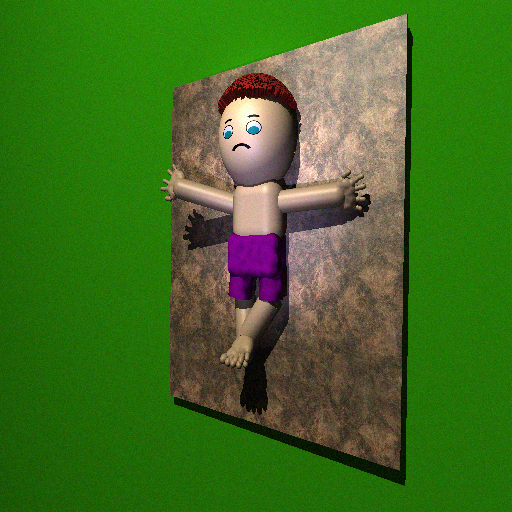 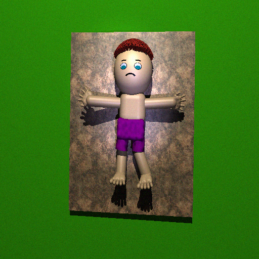 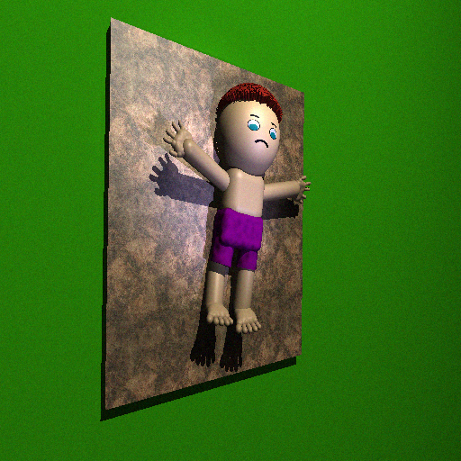</p>
<figcaption>Hair color is specified with red, green, and blue
intensities. The red and blue intensities are set to <span
class="math inline">\(1\)</span> and <span
class="math inline">\(0.25\)</span>, respectively, while the green
intensity is sampled from a normal distribution with a mean of <span
class="math inline">\(0.2\)</span> and a standard deviation of <span
class="math inline">\(0.1\)</span>.</figcaption>
</figure>

## Vectors

ChildSynth similarly supports specifying vectors with subcomponents. For
example, one can rotate the child along the x,y, and z axes. To rotate
the child $180$ degrees along the z-axis (the z-axis points into the
scene) and perform a random translation along the x-axis, one can use
the following syntax. See figure
<a href="#fig:rotation" data-reference-type="ref"
data-reference="fig:rotation">3</a>.

``` bash
python rener_children.py  --child_rotate_z constant:3.1415 --child_shift_x unif:-1.0,1.0
```

<figure id="fig:rotation">
<p>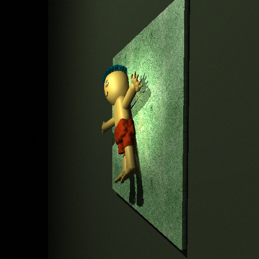 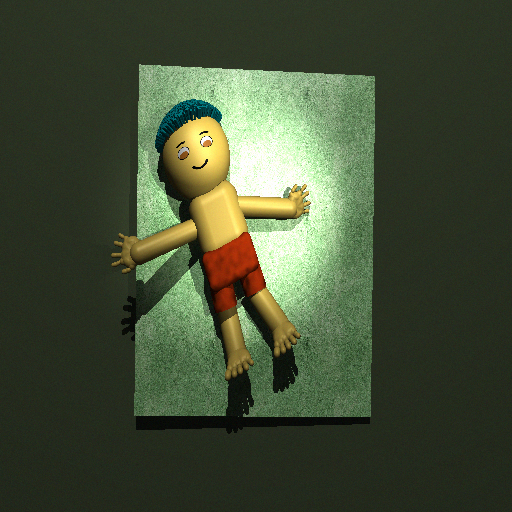 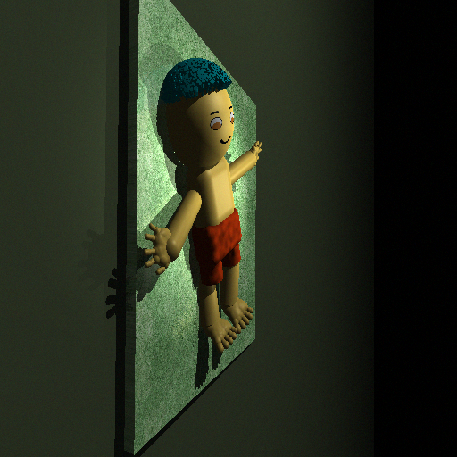</p>
<figcaption>Rotating the child and providing a random shift in the
x-direction</figcaption>
</figure>

By combining shifting with rotation, we obtain an image of a child
standing on the mat.

<figure id="fig:standing">
<p>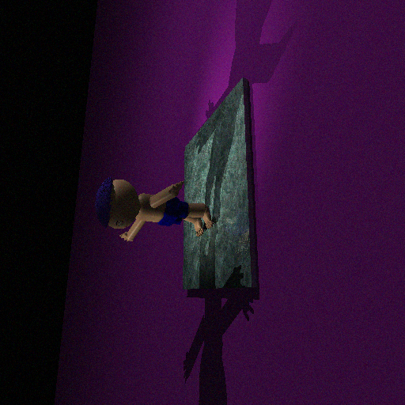 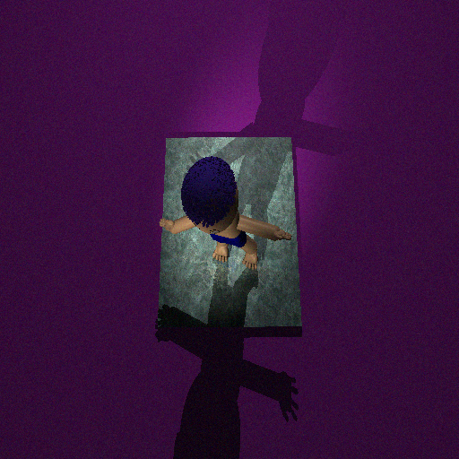 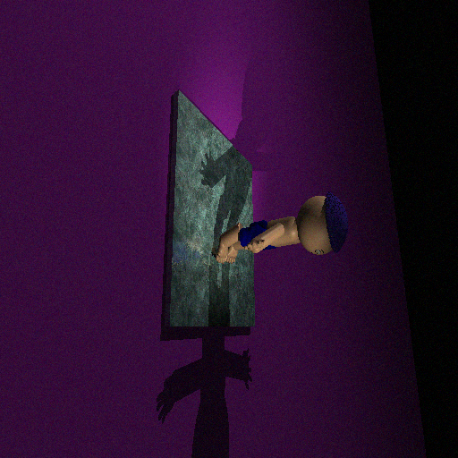</p>
<figcaption>Using a combination of shift and rotation allows us to
obtain an image of a child standing on the mat instead of lying
down.</figcaption>
</figure>

``` bash
render_children.py --child_rotate_x constant:-90 --child_shift_z constant:0.9 --child_shift_y constant:0.4 --camera_distance constant:11
```

# Geometry

## BLOBs (Binary Large OBjects)

Most of the geometry of the synthetic children is composed of BLOBs.
BLOBs are a powerful tool for creating smooth shapes parametrically with
ray tracing.

BLOBs are created from one or more subcomponents, each typically defined
by a field of influence. These fields influence the density of the
medium at their respective locations. When combined, they create a
smooth surface based on a density threshold, meaning the surface of the
BLOB is defined wherever the combined density of all influence spheres
exceeds this threshold.

For example, consider a simple BLOB composed of two spheres. Sphere $1$
has center $c_1 = (0, 0, 0)$, radius $r_1 = 1$, and strength
$s_1 = 1.5$. Sphere $2$ has center $c_2 = (1, 0, 0)$, radius $r_2 = 1$,
and strength $s_2 = 1.5$.

We define a threshold $t_r$ that determines how spread out and smooth
the shape is. A lower threshold means a larger, more spread-out blob as
the surface includes points with lower summed field strengths. A higher
threshold creates a tighter, smaller blob because only points with
higher field strengths are included.

The influence functions for each sphere are given by
$$f_1(p) = 1.5 \left( 1 - \frac{\| p - (0, 0, 0) \|^2}{1^2} \right)^2$$
$$f_2(p) = 1.5 \left( 1 - \frac{\| p - (1, 0, 0) \|^2}{1^2} \right)^2 
.$$

The total strength at any point $p$ is $$S(p) = f_1(p) + f_2(p).$$ The
points, $p$, inside the BLOB are all $p$ such that $S(p) \geq t_r$.

Blobs can consist of spheres and cylinders, and the strength and shape
of each sphere and cylinder can be individually controlled to create a
wide variety of shapes from the resulting field. These composite objects
are beneficial for creating smooth shapes with fine-grained control over
the individual features of the shape. Much of the complexity of the
child’s body is modeled using BLOBs, especially for the feet and hands
(see figure <a href="#fig:hand_foot" data-reference-type="ref"
data-reference="fig:hand_foot">5</a>).

<figure id="fig:hand_foot">
<p>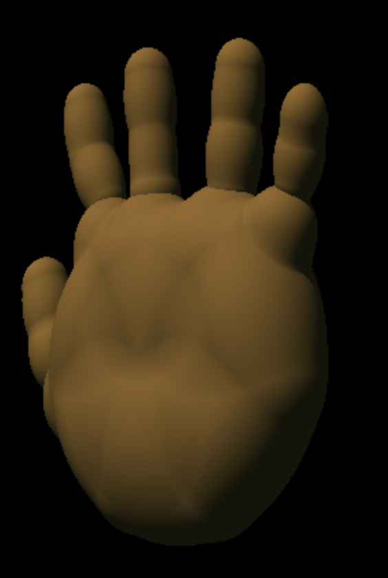 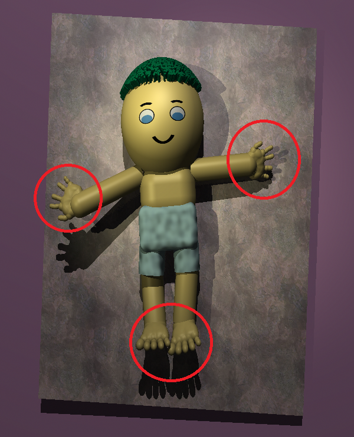 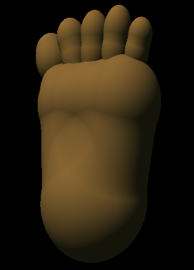</p>
<figcaption>Hands and feet are rendered using BLOBs that consist of a
complex arrangement of parametric spheres and cylinders. The strength
and shape of each sphere and cylinder can be individually controlled to
create a wide variety of shapes from the resulting field.</figcaption>
</figure>

## Procedural Character Generation

ChildSynth uses a hierarchical modeling approach to create the child’s
body, with a central skeleton and parametric definitions for
parent-child relationships. These parent-child relationships change
dynamically as the different body parts are generated based on the
samples from the random distributions. For example, the allowed upper
arm rotations change based on the position and rotation of the main body
to ensure that the arms are positioned realistically and that there is
no clipping with the mat below.

ChildSynth defines every body part and object in the scene by a set of
parameters and a set of rules to assemble those parameters into a
geometry. For example, the upper leg is defined as a blob that is
composed of a main cylinder and several spheres. These sub-components
are generated based on the upper leg length, upper leg circumference,
and the upper leg starting and ending positions.

## The Mat

The primary goal of ChildSynth is to provide sufficient challenge for
the neural network when predicting a child’s height. It is important
therefore not to have any static clues that the model can heavily rely
on to directly predict the child’s height. For example, if a static mesh
was used for the mat with a fixed size, the model could pick up on the
size of the mat and use it to predict the relative height of the child.
To prevent this, the mat is dynamically generated. Furthermore, these
mats are likely not to be perfectly flat.

The mat is generated by creating a heightfield from Simplex noise  and
then triangulating the resulting mesh to simulate wrinkles. Figure
<a href="#fig:mat" data-reference-type="ref"
data-reference="fig:mat">6</a> shows an example mat created from a
triangulated heightfield. Like all geometries in the scene, the
characteristics of the generated wrinkles in the mat are controlled by a
set of parameters that are sampled from various probability
distributions.

<figure id="fig:mat">
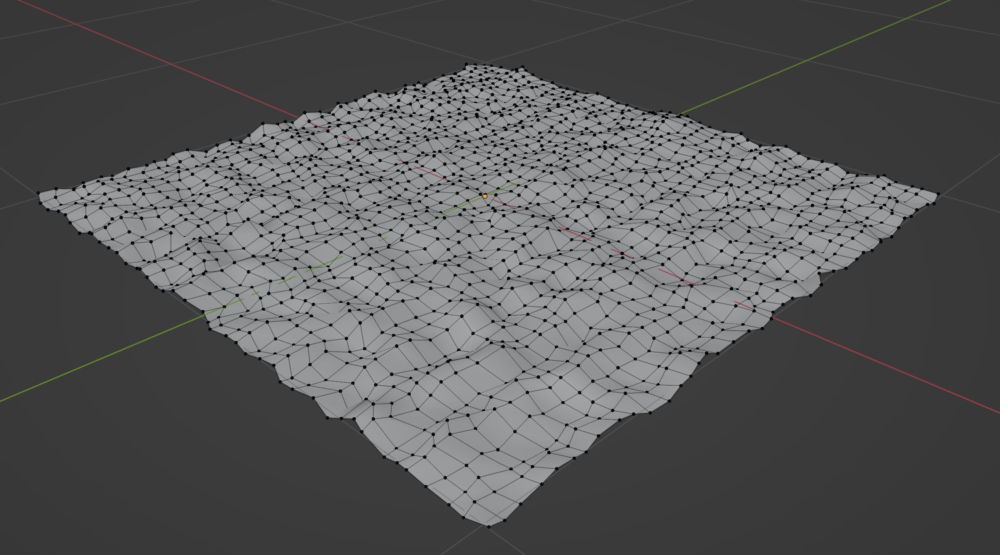
<figcaption>The geometry of the mat is created by triangulating a
heightfield created using simplex noise. This simulates wrinkles in the
mat and prevents the neural network from relying too heavily on the size
of the mat to estimate the child’s height.</figcaption>
</figure>

## Hair

Hair is rendered using a combination of cylinders. Hair density, color,
width variation, and length are all controllable random parameters. Hair
is an important feature since it can make it more difficult to predict
height since it hides the precise location of the top of the head.

# Materials

## Static Textures

The material for the mat that the child is lying on is sampled from
$100$ static public domain textures which are available from
<a href="OpenGameArt.org" class="uri">OpenGameArt.org</a> . These
textures help provide a significant amount of variety in the background
of the images, which helps prevent the neural network from expecting a
specific type of background. The textures are sampled using the choice
distribution by default, which allows one to select one of the $100$
textures with uniform probability. Like all parameters, other sampling
options are available. For example, if one wanted to create $10,000$
images of different children lying on the same mat, one could use the
constant option when specifying the mat texture.

## Dynamic Textures

Most of the textures in the scene are generated dynamically.

### Clothing Textures

Clothing typically has wrinkles and imperfections that are difficult to
model procedurally. To create realistic clothing textures, ChildSynth
uses a combination of procedural modeling, simplex noise, and normal
maps. Having a perfectly smooth texture for the clothing would be
unrealistic and cause the neural network to expect something that would
not be present in real-world images. To simulate wrinkles in the
clothing, a normal map is procedurally generated using simplex noise and
then applied to the geometry.

### Face

A dynamic texture is created for the face of every child to provide
basic facial features. This texture is rendered from scratch using
pycairo . The face texture is created by drawing a series of shapes,
such as circles, rectangles, and lines, to create a face with eyes, a
nose, and a mouth. The color of the face by default is sampled from a
normal distribution to provide a wide variety of skin tones. Figure
<a href="#fig:faces" data-reference-type="ref"
data-reference="fig:faces">7</a> shows four example face textures.

<figure id="fig:faces">
<p>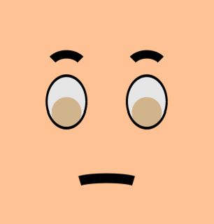 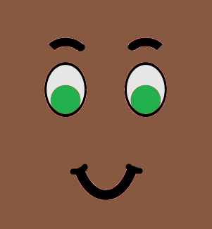 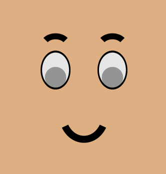 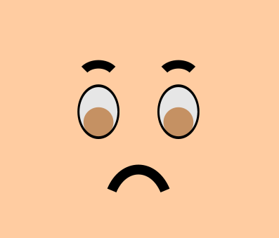</p>
<figcaption>Example face textures rendered dynamically using pycairo.
The color of the face is sampled from a normal distribution to provide a
wide variety of skin tones and is chosen to closely match the skin color
of the rest of the child’s body.</figcaption>
</figure>

# Lighting

By default, ChildSynth provides $4$ light sources in each scene, two
point lights, and two spot lights. The intensity of these lights is
sampled from a uniform distribution to provide soft lighting for the
scene with lights being provided from multiple directions. Each of these
lights can by controlled by tuning the intensity and their positions.
Figure <a href="#fig:lighting" data-reference-type="ref"
data-reference="fig:lighting">8</a> shows an example of a single child
rendered with various light configurations.

<figure id="fig:lighting">
<p>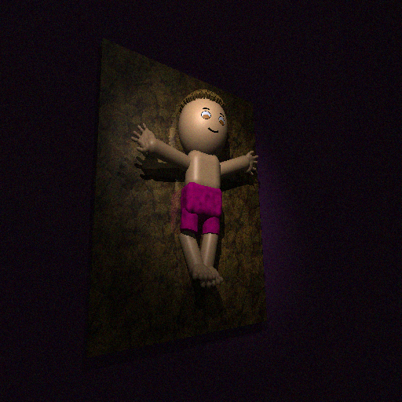 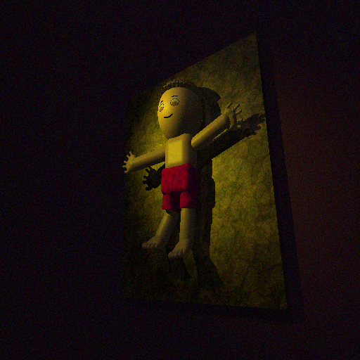 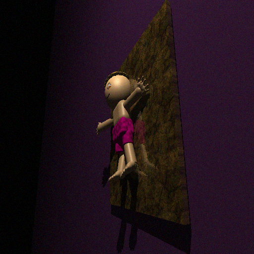 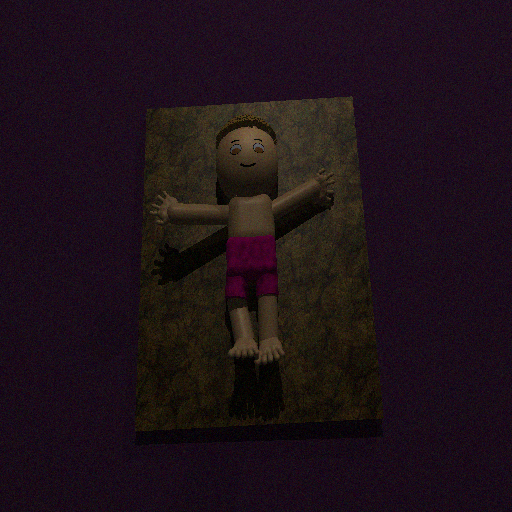 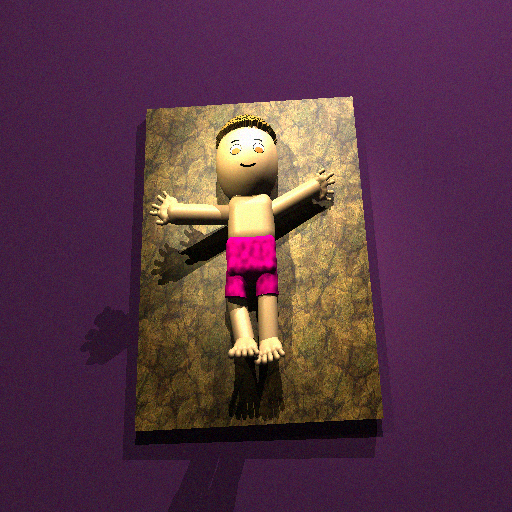</p>
<figcaption>A single child rendered with various light configurations.
The intensity and position of each light source can be controlled to
provide a wide variety of lighting conditions.</figcaption>
</figure>

# Image Quality

ChildSynth provides the ability to add noise to the rendered images to
simulate real-world image noise. This noise is sampled from a Gaussian
distribution with a mean of $0$ and a standard deviation that can be
controlled by the user. The noise is added to the color image and the
depth map. Figure <a href="#fig:noise" data-reference-type="ref"
data-reference="fig:noise">9</a> shows an example of a child rendered
with varying levels of image noise. An additional noise type is provided
to exclude small patches of the image and depth maps to simulate the
effect of dropout in the neural network.

<figure id="fig:noise">
<p>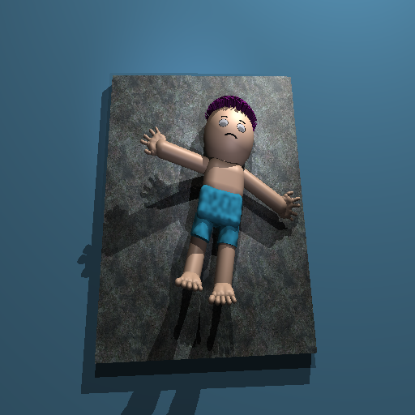  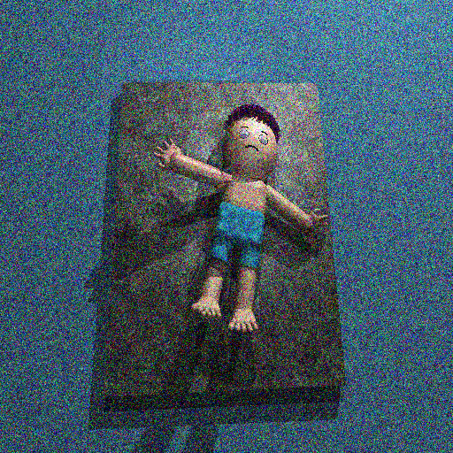 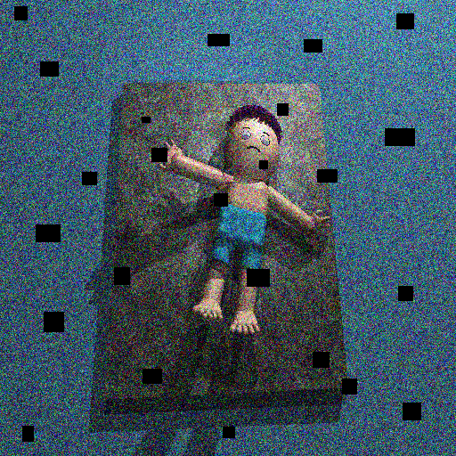</p>
<figcaption>A single child rendered with various noise levels. The noise
is sampled from a Gaussian distribution with a mean of <span
class="math inline">\(0\)</span> and a standard deviation that can be
controlled by the user. Optionally, box noise can be applied to the
image.</figcaption>
</figure>

# Metadata

ChildSynth provides a metadata file for each rendered image that
contains the height of the child along with dozens of other parameters
that could be used for prediction tasks, including all of the random
parameters used in the scene, the camera position, the lighting
conditions, the image quality, and all keypoints, both the 3D
coordinates and the 2D pixel coordinates. This metadata file is saved in
text format. The following is an example of a portion of a metadata file
or a single render. One could use this information to train a neural
network to predict hair color or the distance of the camera for example.

```
child height (cm): 67.158385699556 
seed: 8849
head_size: 0.6278060285782697
skin_color: [1.         0.82084211 0.6872982 ]
shorts_color: [0.25174322 0.75774645 0.9093296 ]
mat_texture: 134
camera_distance: 6.356927988745477
left_arm_angle_z: 4.368737569654856
left_leg_angle_xy: 3.1419316489141185
right_leg_angle_xy: 0.5898018863921284
right_leg_angle_z: 7.382191122717593
...
image_noise_level: 50.0
child_shift_x: 0.036170449604526644
child_shift_y: -0.01152100235935788
child_shift_z: -0.01516996620636548
head_height: 2.7301132563995303
child_height: 3.3579192849778003
...
keypoint_head_top_3d: (0, 3.3579192849778, 0)
keypoint_head_top_2d: [0.5        0.26903642]
keypoint_right_hand_3d: [1.49995483 1.98835873 0.        ]
keypoint_right_hand_2d: [0.65287157 0.41658571]
keypoint_right_foot_3d: (0.32340664142017084, -0.15972602703812186, 0.0)
keypoint_right_foot_2d: [0.53556515 0.68685025]
keypoint_neck_3d: (0, 2.1023072278212607, -0.31)
keypoint_neck_2d: [0.49880674 0.39188964]
keypoint_hip_3d: (0.0, 1.0, -0.31)
keypoint_hip_2d: [0.49875394 0.52880559]
```

# Keypoints

Many computer vision tasks require keypoint detection such as object
tracking, pose estimation, and facial recognition. ChildSynth provides
the ability to generate pixel-perfect keypoint annotations for each
child. The keypoints are generated based on the dynamic geometry of the
children and are then projected onto image space and saved to the
metadata file associated with each view. Figure
<a href="#fig:keypoints" data-reference-type="ref"
data-reference="fig:keypoints">10</a> shows an example of keypoint
annotations for a child lying on a mat. Keypoints are provided for the
top of the head, the neck, the hip, and the feet and hands.

<figure id="fig:keypoints">
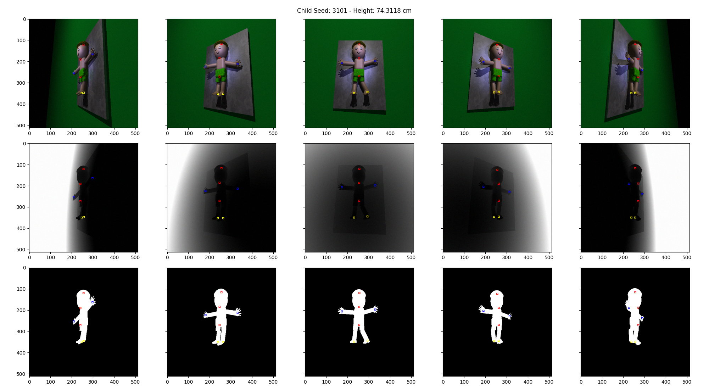
<figcaption>Pixel-perfect keypoint annotations for a child lying on a
mat. Keypoints are provided for the top of the head, the neck, the hip
(rendered in red), and the feet (rendered in yellow) and hands (rendered
in green).</figcaption>
</figure>

# Conclusion

ChildSynth is a powerful tool for generating synthetic imagery of
children with pixel-perfect measurements for use in evaluating and
training computer vision models. It is fully customizable and can
generate an unlimited number of images with varying characteristics.
Figure <a href="#fig:variety" data-reference-type="ref"
data-reference="fig:variety">11</a> shows $15$ different synthetic
children rendered with default parameters.

<figure id="fig:variety">

<figcaption>Example of <span class="math inline">\(15\)</span> different
synthetic children rendered with default parameters</figcaption>
</figure>

# Reference

Tables <a href="#table:defaults" data-reference-type="ref"
data-reference="table:defaults">1</a> and
<a href="#table:defaults_2" data-reference-type="ref"
data-reference="table:defaults_2">2</a> list all the available
parameters and their default sample distributions. Table
<a href="#table:params" data-reference-type="ref"
data-reference="table:params">3</a> provides a listing all standard
command line arguments. For example, to set the output resolution to
$512 \times 512$ pixels, one would use the following command:

``` bash
python render_children.py --resy 512 --resx 512
```

Table <a href="#table:eye_colors" data-reference-type="ref"
data-reference="table:eye_colors">4</a> provides a list of available eye
colors.

<div id="table:defaults">

| **Parameter**           | **Distribution** | **Parameters**                   | **Description**                    |
|:------------------------|:-----------------|:---------------------------------|:-----------------------------------|
| `head_size`             | normal           | 0.8, 0.2                         | The size of the head               |
| `skin_color`            | color            | (1, 0.8, 0.6), (0.1, 0.1, 0.1)   | RGB skin color                     |
| `shorts_color`          | color            | (0.5, 0.5, 0.5), (0.5, 0.5, 0.5) | RGB shorts color                   |
| `mat_texture`           | integer          | 101, 200                         | Mat texture name                   |
| `camera_distance`       | normal           | 6.2, 0.2                         | Distance of camera to child        |
| `rotation_adj`          | normal           | 0.0, 4.0                         | Arm rotation adjustment            |
| `right_arm_angle_xy`    | normal           | 0.0, 10.0                        | Right arm rotation xy              |
| `left_arm_angle_xy`     | normal           | 0.0, 10.0                        | Left arm rotation xy               |
| `right_arm_angle_z`     | normal           | 0.0, 5.0                         | Right arm rotation z               |
| `left_arm_angle_z`      | normal           | 0.0, 5.0                         | Left arm rotation z                |
| `left_leg_angle_xy`     | normal           | 0.0, 10.0                        | Left leg rotation xy               |
| `right_leg_angle_xy`    | normal           | 0.0, 10.0                        | Right leg rotation xy              |
| `right_leg_angle_z`     | normal           | 0.0, 5.0                         | Left leg angle z                   |
| `left_leg_angle_z`      | normal           | 0.0, 5.0                         | Left leg angle z                   |
| `body_height`           | normal           | 2.48, 0.16                       | Height of main body                |
| `body_width`            | normal           | 0.8, 0.1                         | Width of the main body             |
| `body_depth`            | normal           | 0.3, 0.1                         | Depth of the main body             |
| `light_x`               | unif             | -5.0, 5.0                        | X position of primary light        |
| `light_y`               | unif             | -5.0, 5.0                        | Y position of primary light        |
| `light_z`               | unif             | -5.0, 5.0                        | Y position of primary light        |
| `light1`                | unif             | 0.3, 1.0                         | Intensity of light 1 (primary)     |
| `light2`                | unif             | 0.3, 1.0                         | Intensity of light 2 (point light) |
| `light3`                | unif             | 0.2, 1.0                         | Intensity of light 3 (spotlight 1) |
| `light4`                | unif             | 0.3, 1.0                         | Intensity of light 4 (spotlight 2) |
| `backcolor_red`         | unif             | 0.0, 1.0                         | Background color red               |
| `backcolor_green`       | unif             | 0.0, 1.0                         | Background color green             |
| `backcolor_blue`        | unif             | 0.0, 1.0                         | Background color blue              |
| `haircolor_red`         | unif             | 0.0, 1.0                         | Hair color red                     |
| `haircolor_green`       | unif             | 0.0, 1.0                         | Hair color green                   |
| `haircolor_blue`        | unif             | 0.0, 1.0                         | Hair color blue                    |
| `eye_color_index`       | integer          | 0, 9                             | Eye color number                   |
| `smile_factor`          | unif             | -40.0, 100.0                     | Smiling factor (100=full smile)    |
| `mat_rotate_y`          | unif             | -2.0, 2.0                        | Mat rotation y axis                |
| `mat_rotate_z`          | unif             | -3.0, 3.0                        | Mat rotation x axis                |
| `child_rotate_y`        | normal           | 0.0, 6.0                         | Child rotation y axis              |
| `child_rotate_z`        | normal           | 0.0, 6.0                         | Child rotation z axis              |
| `child_rotate_x`        | normal           | 0.0, 0.01                        | Child rotation x axis              |
| `hair_count`            | unif             | 250, 4000                        | Number of hair follicles           |
| `hair_length`           | unif             | 0.10, 0.18                       | Average hair length                |
| `image_noise_level`     | unif             | 0.0, 8.0                         | Gaussian image noise level         |
| `image_box_level`       | unif             | 0.0, 0.01                        | Box image noise level              |
| `child_shift_x`         | unif             | -0.05, 0.05                      | Child translation x                |
| `child_shift_y`         | unif             | -0.05, 0.05                      | Child translation y                |
| `child_shift_z`         | unif             | -0.05, 0.05                      | Child translation z                |
| `foot_size`             | unif             | 0.15, 0.23                       | Foot size                          |
| `hand_size`             | unif             | 0.12, 0.21                       | Hand size                          |
| `average_finger_length` | unif             | 0.05, 0.08                       | Average finger length              |
| `average_toe_length`    | unif             | 0.03, 0.05                       | Average toe length                 |
| `light_1_color_red`     | unif             | 0.5, 1.0                         | Light 1 color red                  |
| `light_1_color_green`   | unif             | 0.5, 1.0                         | Light 1 color green                |
| `light_1_color_blue`    | unif             | 0.5, 1.0                         | Light 1 color blue                 |
| `light_2_color_red`     | unif             | 0.5, 1.0                         | Light 2 color red                  |
| `light_2_color_green`   | unif             | 0.5, 1.0                         | Light 2 color green                |
| `light_2_color_blue`    | unif             | 0.5, 1.0                         | Light 2 color blue                 |
| `light_3_color_red`     | unif             | 0.5, 1.0                         | Light 3 color red                  |
| `light_3_color_green`   | unif             | 0.5, 1.0                         | Light 3 color green                |
| `light_3_color_blue`    | unif             | 0.5, 1.0                         | Light 3 color blue                 |
| `light_4_color_red`     | unif             | 0.1, 0.3                         | Light 4 color red                  |
| `light_4_color_green`   | unif             | 0.1, 0.3                         | Light 4 color green                |
| `light_4_color_blue`    | unif             | 0.1, 0.3                         | Light 4 color blue                 |
| `light_1position_x`     | unif             | -5.0, 5.0                        | Light 1 position x                 |
| `light_1position_y`     | unif             | -5.0, 5.0                        | Light 1 position y                 |
| `light_1position_z`     | unif             | -5.0, 5.0                        | Light 1 position z                 |
| `light_2position_x`     | unif             | -5.0, 5.0                        | Light 2 position x                 |
| `light_2position_y`     | unif             | -5.0, 5.0                        | Light 2 position y                 |
| `light_2position_z`     | unif             | -5.0, 5.0                        | Light 2 position z                 |

ChildSynth default parameters part 1

</div>

<div id="table:defaults_2">

| **Parameter**         | **Distribution** | **Parameters** | **Description**              |
|:----------------------|:-----------------|:---------------|:-----------------------------|
| `matt_width`          | unif             | 3.0, 4.0       | The width of the mat         |
| `matt_height`         | unif             | 3.0, 4.0       | The height of the mat        |
| `matt_thickness`      | unif             | 3.0, 4.0       | The mat’s average thickness  |
| `matt_wrinkle_height` | normal           | 0.1, 0.01      | mat’s average wrinkle height |
| `matt_wrinkle_freq`   | normal           | 0.4, 0.02      | mat’s wrinkle frequency      |
| `matt_texture`        | choice           | 100            | The texture of the mat       |
| `image_noise_level`   | unif             | 0.0, 8.0       | Gaussian image noise level   |
| `image_noise_box`     | constant         | 0.0            | Box image noise level        |
| `eye_color_index`     | choice           | 10             | Eye color index              |
| `eye_size`            | normal           | 0.1, 0.01      | Eye size                     |
| `eyebrow_height`      | normal           | 0.1, 0.01      | Eyebrow height               |
| `eyebrow_width`       | normal           | 0.1, 0.01      | Eyebrow width                |
| `eyebrow_spacing`     | normal           | 0.09, 0.005    | Eyebrow spacing              |
| `mouth_width`         | normal           | 0.12, 0.012    | Mouth width                  |

ChildSynth default parameters part 2

</div>

<div id="table:params">

| **Parameter**  | **Default** | **Description**                             |
|:---------------|:------------|:--------------------------------------------|
| `resx`         | 512         | The width in pixels of the image            |
| `resy`         | 512         | The height in pixels of the image           |
| `seed`         | not set     | An optional random seed for reproducibility |
| `num_children` | 1           | The number of children to render            |

ChildSynth standard arguments

</div>

<div id="table:eye_colors">

| **Eye Color**       |   **RGB Values**   |
|:--------------------|:------------------:|
| Dark Brown          | (0.39, 0.26, 0.13) |
| Light Brown / Hazel | (0.58, 0.34, 0.10) |
| Blue                | (0.26, 0.50, 0.72) |
| Green               | (0.15, 0.58, 0.40) |
| Amber               | (0.77, 0.57, 0.39) |
| Gray                | (0.58, 0.58, 0.58) |
| Honey               | (0.82, 0.70, 0.55) |
| Teal                |  (0.0, 0.5, 0.5)   |
| Golden              | (0.70, 0.42, 0.14) |
| Copper              | (0.62, 0.32, 0.17) |

Available eye colors and their RGB values

</div>

# ChildSynth Modeling Pipeline

## Introduction
Welcome to the **Synthetic Kids' Data Modeling Pipeline for Height Prediction**, a streamlined solution for training, testing, and visualizing deep learning models using synthetic children's data. For accessing the synthetic kids' image dataset, visit the [repository](https://github.com/davidberth/ac297r_project6).

## Features
- **Data Pickle File Transformation**: Turn image data into pickle files for training, testing, and visualization purposes.
- **Automated Directory Management**: Automatically creates `results` and `vis` directories to store metadata, training logs, testing logs, model weights, and visualization diagrams, etc. Under the `results` directory, the script creates a session directory with a unique random hash for each training session.
- **Versatile Script**: Capable of performing training, testing, and visualization in a few lines of bash command.

## Getting Started
To get started with the pipeline, create a conda environment using the provided [`environment.yml`](modeling/environment.yml) file with the following command:

```bash
conda env create -f environment.yml
conda activate pytorch
```

# Usage

## Step 1: Prepare the Data
To download the image data, visit the [repository](https://github.com/davidberth/ac297r_project6).

**Transform the image dataset into a pickle file for faster data loading:**
```bash
python3 src/to_pickle.py --data_dir <your_image_data_path> --train_size 0.9
```

## Step 2: Train the Model

**Train the model, save the best model according to the validation set, and make inferences on test data:**
```bash
python3 src/main.py --model_name vgg16 --train_data_dir <your_data_path> --epochs 200 --batch_size 64 --device cuda
```

## Step 3: Visualize the Results

**Visualize all modeling sessions at once:**
```bash
python3 src/vis.py --all True
```

**Visualize a single modeling session:**
```bash
python3 src/vis.py --all False --session_path <your_modeling_session_path>
```

Please replace `<your_image_data_path>` and `<your_data_path>` with the actual paths to your data, and `<your_modeling_session_path>` with the path to your specific modeling session.

## Step 4: Error Analysis

1. Open the Jupyter notebook titled [`error_analysis_demo.ipynb`](modeling/error_analysis_demo.ipynb)
2. Locate the line of code that reads:
```python
session_path = <your_modeling_session_path> # Define your session path
```
3. Replace `<your_modeling_session_path>` with the path to your modeling session
4. Run all cells in the notebook to execute the error analysis.


## Configuration Arguments

### For [`to_pickle.py`](modeling/src/to_pickle.py)
Customize the data processing with these arguments:

- **`--data_dir`**: Path to the dataset directory. Default: `E:\\synthetic_kids`.
- **`--image_type`**: Type of image (e.g., `depth`, `color`). Default: `depth`.
- **`--mode`**: Dataset mode. Default: `None`.
- **`--expand`**: Maintain 3 channels or average to 1 channel. Default: `True`.
- **`--train_size`**: Proportion of the dataset for training. Default: `0.9`.

### For [`main.py`](modeling/src/main.py)
The `main.py` script offers a variety of command-line arguments for customization:

- **`--model_name`**: The model to use. Default: `resnet34`.
- **`--train_data_dir`**: The training data directory. Default: `E:\\db_synthetic_1`.
- **`--epochs`**: Number of training epochs. Default: `100`.
- **`--batch_size`**: Batch size for data processing. Default: `128`.
- **`--learning_rate`**: Learning rate for training. Default: `0.0001`.
- **`--device`**: Device for training (use `mps` for Mac). Default: `cuda`.
- **`--save_interval`**: Model save interval during training (set `-1` for no periodic save). Default: `-1`.
- **`--patience`**: Epochs to wait before early stopping. Default: `30`.
- **`--train_split`**: Dataset ratio for training. Default: `0.8`.
- **`--test_only`**: Perform only inference if `True`. Default: `False`.
- **`--session_path`**: Path to the trained model for testing (required if `--test_only` is `True`).

### For [`vis.py`](modeling/src/vis.py)
Configure the visualization of results with these command-line arguments:

- **`--all`**: If set to `True`, visualizes all sessions in the results directory. Default: `True`.
- **`--session_path`**: Specifies the path for visualizing a single session. This argument is not required if `--all` is set to `True`.

Remember to adjust these settings according to your project requirements and system configuration.

# Visualization Snapshot


# License
This project is licensed under the MIT License - see the [`LICENSE.md`](modeling/LICENSE) file for details.